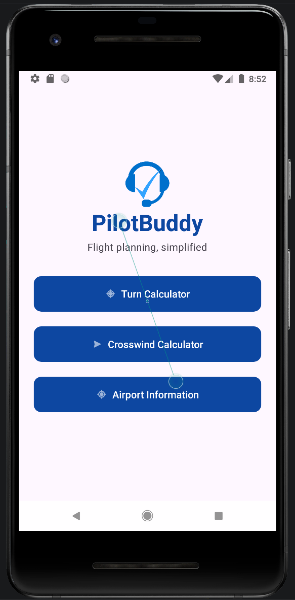
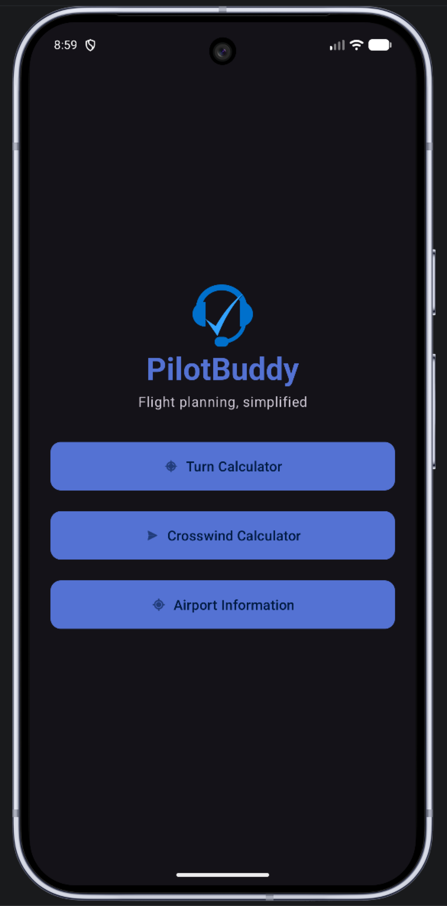
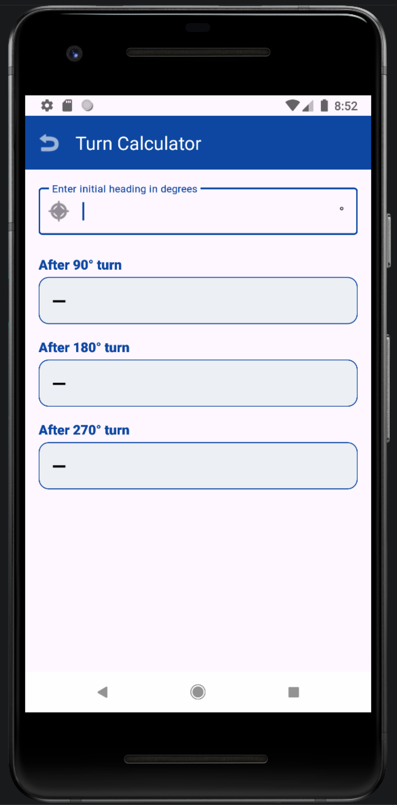
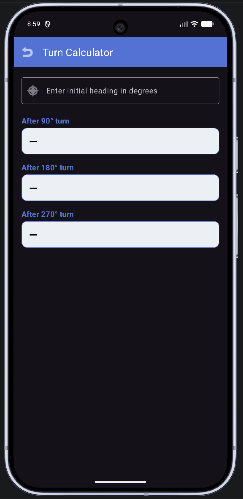
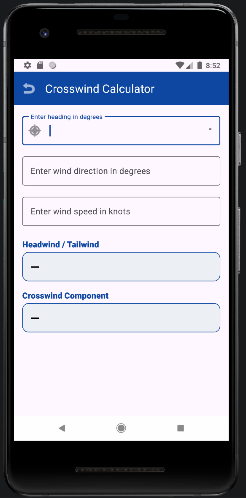
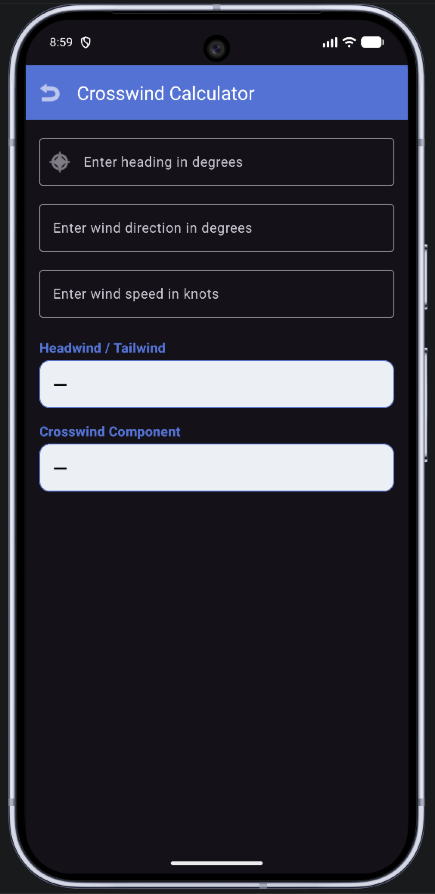
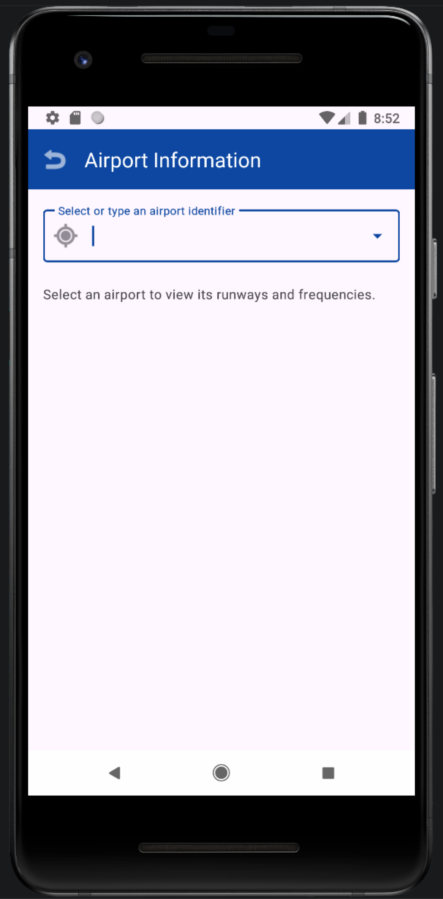
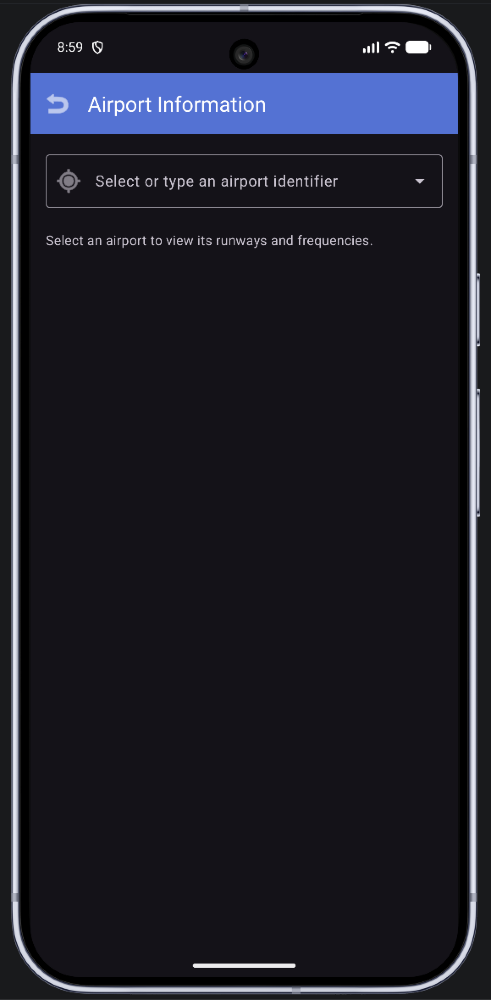

# PilotBuddy

Android app for general aviation and student pilots that consolidates common flight planning calculations into one mobile tool.

## Project Description

PilotBuddy performs course reversal calculations (90/180/270 procedure turns), computes crosswind and headwind components from a given heading and wind speed/direction, and provides quick-reference airport information including runway layout and common radio frequencies for a selected airport.

## Problem Addressed

Pilots currently rely on paper E6B flight computers, printed charts, or separate apps to perform these tasks during preflight planning and in the cockpit. Manually working through wind triangle math or looking up airport data across multiple sources is slow and increases the chance of error, particularly under time pressure such as during an instrument approach course reversal. PilotBuddy places the three most frequently needed calculations and references into one app, reducing lookup time and the risk of hand-calculation mistakes.

## Platform

- Target OS: Android
- Development environment: Android Studio with the Android SDK
- Language: Java
- Target devices: Android phones and tablets

## Front-End / Back-End Support

**Front end**
- Standard Android Activities and Fragments for each major function (turn calculator, wind calculator, airport lookup)
- Input fields and numeric pickers for course, heading, and wind values, with results displayed immediately on the same screen

**Back end**
- Turn and wind calculations are computed locally on the device, no server call required
- Airport information (runways, frequencies) is stored in a local SQLite database bundled with the app, structured as an airport table keyed by ICAO/FAA identifier with related runway and frequency tables
- Data is normalized into separate airport, runway, and frequency tables rather than one flat table, to avoid repeating airport-level data for every runway or frequency entry
- A future iteration could add a live aviation data API, the initial version uses a static, locally stored dataset so the app works without an internet connection

## Functionality

**90/180/270 Course Calculator**
- User enters a given course
- App returns the resulting heading after a 90, 180, or 270 degree turn in either direction

**Crosswind / Headwind Calculator**
- User enters runway or aircraft heading, plus wind speed and direction
- App calculates and displays the crosswind component and headwind/tailwind component

**Airport Information Lookup**
- User searches for an airport by identifier
- App displays runway layout (numbers, length, surface) and common frequencies (CTAF, tower, ground, ATIS) for that airport

## Design (Wireframes)

Simple tab or menu-based navigation from a home screen to the three core tools. Planned screen flow, left to right:

| Home | Turn Calculator | Wind Calculator | Airport Info |
| :--: | :-------------: | :-------------: | :----------: |
|  |  |  |  |
| App title and three navigation buttons, one per tool | Single input field for current course, three result fields for 90/180/270 outcomes | Input fields for heading, wind direction, and wind speed, with output fields for crosswind and headwind/tailwind components | Search field for airport identifier, results area listing runways and frequencies for the matched airport |

## Application Development

The screenshots below show the working Android build of each screen from the wireframes above. Every screen was captured on an Android emulator in both a light theme and a dark theme. The three tool screens appear in their empty state, before any values are entered.

| Screen | Light Theme | Dark Theme |
| :----: | :---------: | :--------: |
| **Home** |  |  |
| **Turn Calculator** |  |  |
| **Crosswind Calculator** |  |  |
| **Airport Information** |  |  |

**Screen notes**
- The home screen provides one button for each of the three tools.
- The Turn Calculator takes an initial heading and has three result fields for the 90, 180, and 270 degree turns.
- The Crosswind Calculator takes a heading, wind direction, and wind speed, and has result fields for the headwind/tailwind and crosswind components.
- The Airport Information screen uses a dropdown field that accepts either a typed airport identifier or a selection from the list.
- Each tool screen has a back arrow in the top app bar.

## Course

COM 437: Mobile Application Development — Module 2 Project Outline
